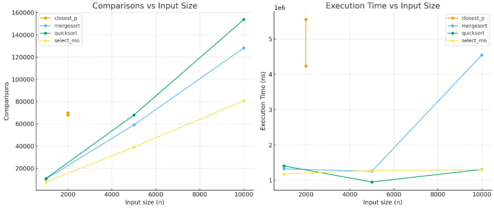

# Assignment 1

# Architecture notes
*MergeSort*: cut-off to insertion sort reduces depth and allocations. One shared buffer for merge.

*QuickSort*: random pivot and recursion only on the smaller side - stack depth stays O(log n).

*Deterministic Select*: Median-of-Medians (groups of 5) guarantees balanced pivots and linear time.

*Closest Pair*: divide by x, merge by y. Only up to 7 neighbor checks in strip - controlled comparisons.

# Comparisons and execution time vs input size:

# MergeSort
Recurrence: T(n) = 2T(n/2) + Θ(n). Master theorem gives Θ(n log n). Depth is Θ(log n).

# QuickSort
Average case: T(n) = T(X) + T(n-1-X) + Θ(n) - Θ(n log n). Worst case Θ(n^2), but stack depth limited to O(log n) by smaller-side recursion.

# Deterministic Select
Recurrence: T(n) = T(n/5) + T(7n/10) + Θ(n). Akra–Bazzi gives Θ(n). Always linear time.

# Closest Pair
Recurrence: T(n) = 2T(n/2) + Θ(n). Master theorem gives Θ(n log n).

# Summary
Theory and practice mostly match. QuickSort is often faster in time because of lower constants but does more comparisons. MergeSort depth depends on cut-off. Deterministic Select grows linearly as expected. Closest Pair follows n log n. Constant factors  explain small differences.

git init
git remote add origin https://github.com/quralai-baqytnur/assik1_DAA.git
git checkout -b main
git add .
git commit -m "init: maven, junit5, ci, readme"
git push -u origin main
